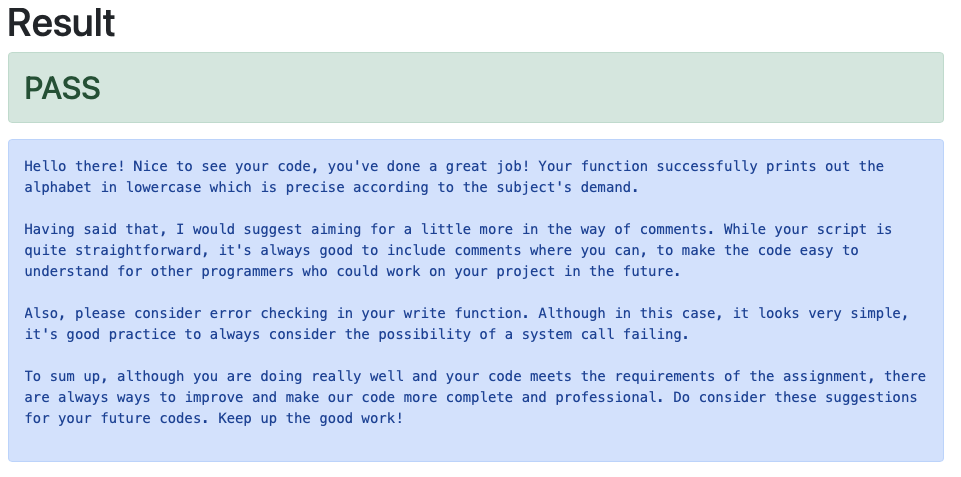

# Hey there, welcome to my Code Review Platform Prototype!
Alright, let's cut to the chase. What is this thing? 


This is a super cool prototype of a web app that helps you review your C code. Yes, you heard it right, it's like your buddy who checks your code. 

And who's the buddy? It's none other than the highly advanced AI - OpenAI's GPT-4 model. So no more begging for code reviews, GPT-4 got your back!



## What's in the box?

- A slick web interface where you can paste your C code.
- Our app then compiles and runs the code to make sure it's correct.
- And it also shows you how your output stacks up against the expected output.
- Last but not least, GPT-4 steps in to give you some feedback on how to improve your code.

## Getting started

### What you need

- Python 3.8 or higher (because we're cool like that)
- Flask (our secret sauce)
- OpenAI Python client library (where the magic happens)

### Let's set it up!

1. Clone this thing:
   ```
   git clone https://github.com/Awis13/AI-Code-reviewer
   ```
2. Jump right in:
   ```
   cd code-review-platform
   ```
3. Get the necessary stuff (Python packages):
   ```
   pip install -r requirements.txt
   ```
4. And don't forget to set your OpenAI API Key in `app.py`:
   ```python
   openai.api_key = "<Your OpenAI API Key>"
   ```

## Let's roll!

Fire it up with:
```
python app.py
```
Then, take a stroll to `localhost:5000` in your browser. Paste your C code into the form and hit the submit button. Sit back and watch GPT-4 do its thing!

## Yeah, but...


Okay, we hear you! Right now this only works with C code, and it's all set around one problem (you have to print the alphabet in lowercase on a single line). 

And yes, GPT-4 is not perfect, it's doing its best but it might not always get the feedback spot on. Also, we don't have any user management or a way to store your past code reviews (yet!). 

## The Road Ahead

- Covering more programming languages.
- Setting up a way to store all the past code and reviews.
- Getting a user management system.
- Including more fun coding challenges.

